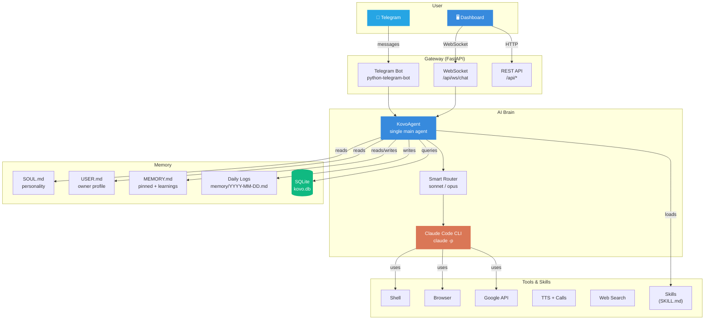
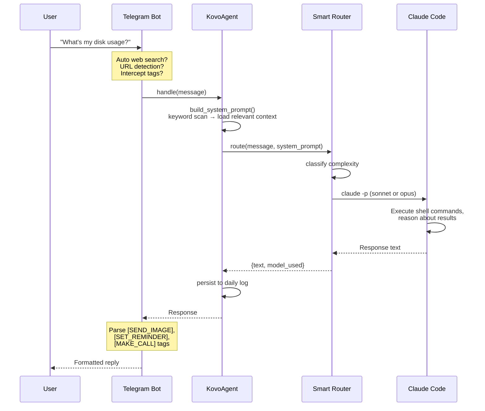
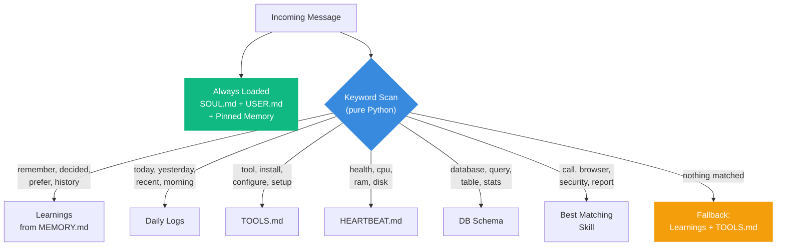
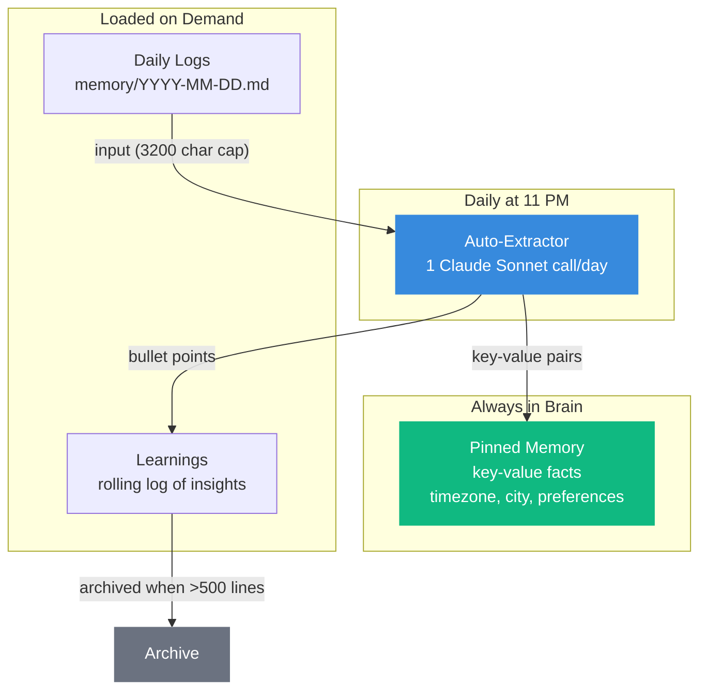
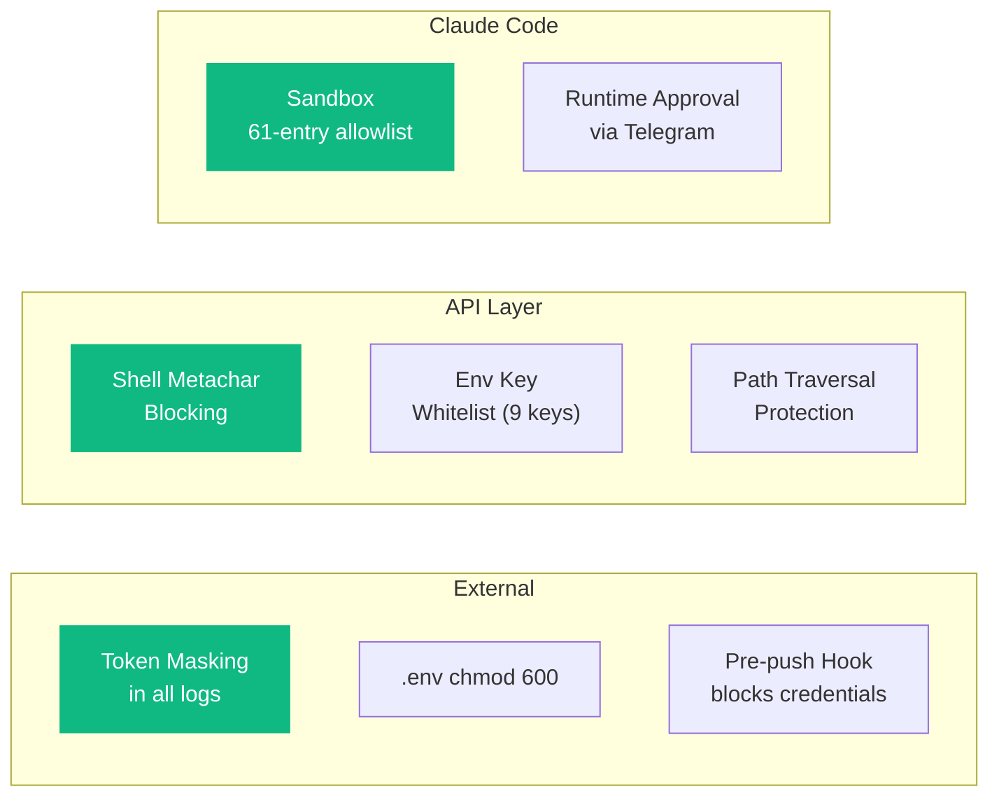

# KOVO Architecture

KOVO is a self-hosted AI agent powered by Claude Code. This document explains how the system works.

## System Overview



## Message Flow

When you send a message to KOVO, here's what happens:



## Smart Context Loading

KOVO doesn't load everything into every prompt. It uses keyword matching to load only what's needed:



This saves **60-90% of system prompt tokens** on routine messages.

## Tag System

The agent communicates actions to the bot through tags in its response text:

| Tag | Action | Example |
|---|---|---|
| `[SEND_IMAGE: query]` | Search and send a photo | `[SEND_IMAGE: sunset over Dubai]` |
| `[SET_REMINDER: msg \| time \| delivery]` | Create a reminder | `[SET_REMINDER: Call dentist \| 2026-04-02T15:00 \| message]` |
| `[MAKE_CALL: message]` | Place a voice call | `[MAKE_CALL: Good morning, your disk is 90% full]` |

The bot layer parses these tags, executes the action, and strips them from the visible response.

## Memory System



## Heartbeat System

5 scheduled jobs run automatically via APScheduler:

| Schedule | Job | Description |
|---|---|---|
| Daily 3:00 AM | Archive logs | Move daily logs older than 30 days |
| Daily 11:00 PM | Auto-extract | Extract learnings from today's log |
| Sunday 3:30 AM | Consolidation | Archive learnings if >500 lines |
| Daily 10:00 AM | Version check | Check GitHub for new releases |
| Every 60 seconds | Reminders | Fire due reminders (message/call) |

## Security Layers



## Project Structure

```
<KOVO_DIR>/                  # /opt/kovo (Linux) or ~/.kovo (macOS)
├── src/
│   ├── gateway/             # FastAPI app, config, routes
│   ├── telegram/            # Bot, commands, formatting
│   ├── agents/              # KovoAgent + sub-agent runner  
│   ├── memory/              # Pinned + Learnings + SQLite
│   ├── tools/               # Shell, browser, calls, search, etc.
│   ├── skills/              # Skill registry + loader
│   ├── heartbeat/           # APScheduler jobs
│   ├── router/              # Smart model router
│   ├── onboarding/          # First-run 5-question flow
│   ├── utils/               # platform.py, tz.py
│   └── dashboard/           # React + Vite + Tailwind
├── workspace/
│   ├── SOUL.md              # Agent personality
│   ├── USER.md              # Owner profile
│   ├── MEMORY.md            # Pinned + Learnings
│   ├── memory/              # Daily logs
│   └── skills/              # SKILL.md per skill
├── config/                  # .env, settings.yaml
├── data/                    # kovo.db, security, backups
├── scripts/                 # update.sh, backup.sh, restore.sh
└── bootstrap.sh             # One-line installer
```

## Cross-Platform

All paths flow through `src/utils/platform.py`. No source file hardcodes `/opt/kovo`.

| Platform | Install Path | Service | Package Manager |
|---|---|---|---|
| Linux | `/opt/kovo` | systemd | apt |
| macOS | `~/.kovo` | launchd | Homebrew |

The `KOVO_DIR` environment variable overrides auto-detection on any platform.
