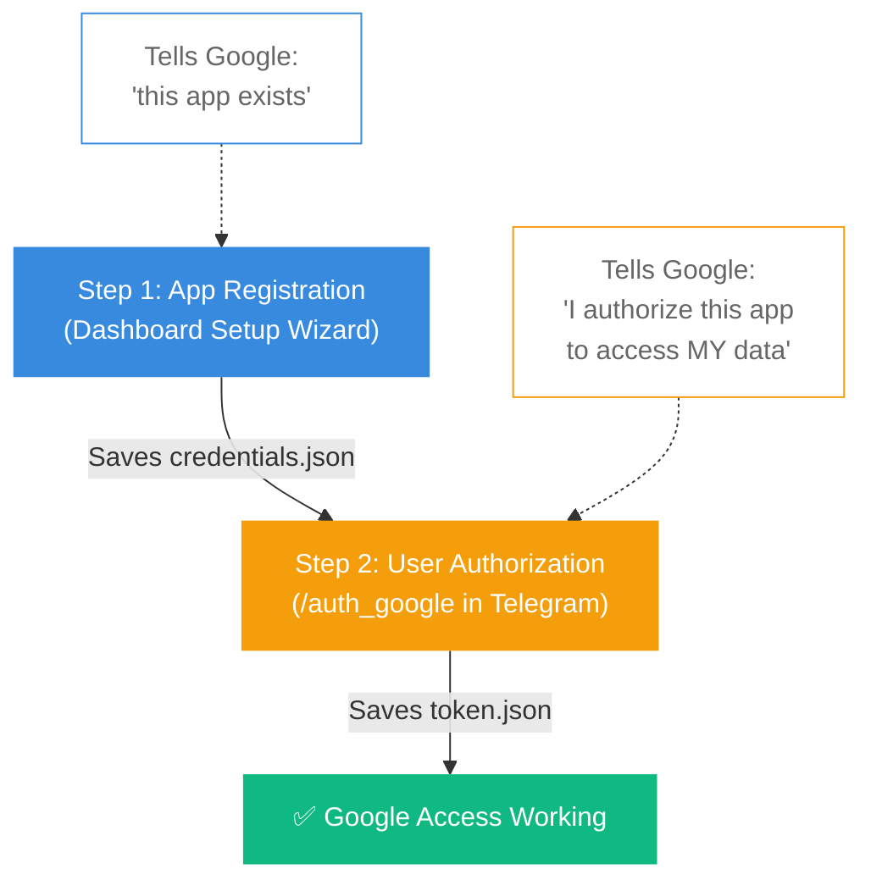
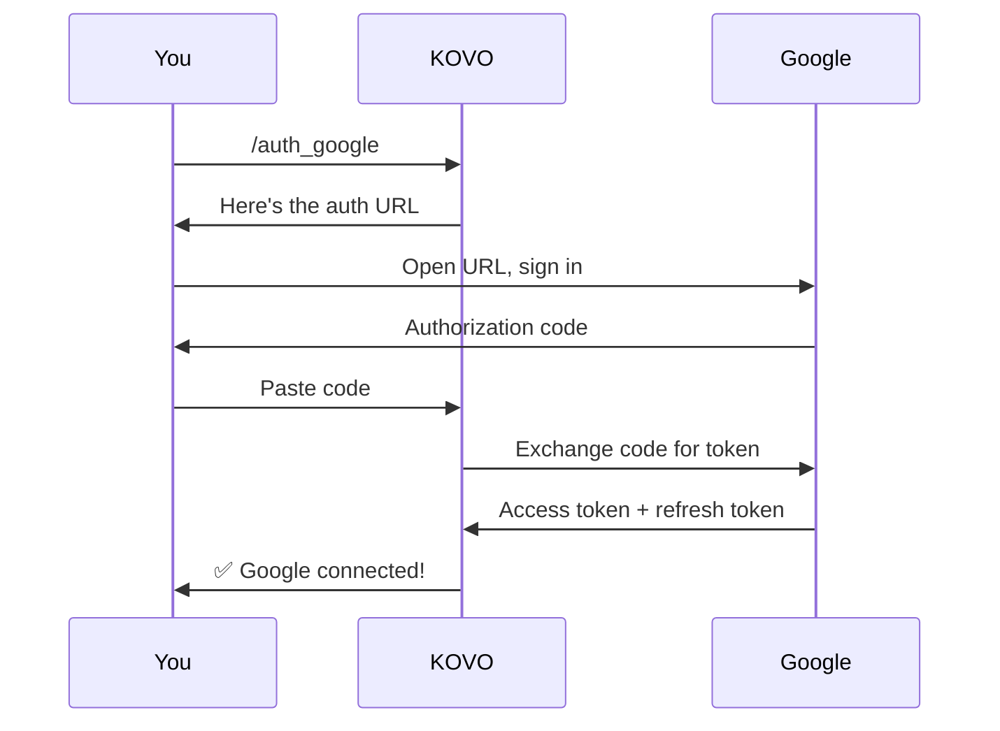

# Google Workspace Setup

KOVO can access Google Docs, Drive, Gmail, Calendar, and Sheets on your behalf. Setup is a **two-step process**:

## The Two Steps

## Step 1: Create Google Credentials (Dashboard)

This happens during the Setup Wizard, or you can do it later from Settings.

1. Go to [Google Cloud Console](https://console.cloud.google.com/) → create or select a project
2. Enable the APIs KOVO needs:
   - [Google Drive API](https://console.cloud.google.com/apis/library/drive.googleapis.com)
   - [Google Docs API](https://console.cloud.google.com/apis/library/docs.googleapis.com)
   - [Gmail API](https://console.cloud.google.com/apis/library/gmail.googleapis.com)
   - [Google Calendar API](https://console.cloud.google.com/apis/library/calendar-json.googleapis.com)
   - [Google Sheets API](https://console.cloud.google.com/apis/library/sheets.googleapis.com)
3. Go to [Credentials](https://console.cloud.google.com/apis/credentials) → **Create Credentials** → **OAuth 2.0 Client ID** → select **Desktop app**
4. Download the JSON file
5. Paste its contents into the Setup Wizard's Google page (or upload to `config/google-credentials.json`)

> **What this does:** Registers your KOVO installation as an app with Google. The JSON file contains your `client_id` and `client_secret` — it's like a passport for the app, but it doesn't grant access to any data yet.

## Step 2: Authorize Your Account (Telegram)

After the Setup Wizard is complete and KOVO is running:

1. Open your KOVO bot in Telegram
2. Send: `/auth_google`
3. KOVO replies with an authorization URL
4. Open the URL in your browser
5. Sign in with your Google account
6. Click **"Allow"** to grant KOVO access
7. Copy the authorization code shown
8. Paste it back in Telegram

> **What this does:** You personally authorize KOVO to access your Gmail, Drive, etc. The resulting token is stored at `config/google-token.json` and auto-refreshes — you only do this once.

## After Setup

Once authorized, you can talk to KOVO naturally:

- "Send an email to john@example.com about the project update"
- "What's on my calendar tomorrow?"
- "Find the Q3 report on Google Drive"
- "Create a new Google Doc titled Meeting Notes"

## Common Issues

| Problem | Cause | Fix |
|---|---|---|
| "Not authorized" | Step 2 not done | Send `/auth_google` in Telegram |
| "Invalid client" | Wrong credentials JSON | Re-download from Cloud Console |
| "Access denied" | API not enabled | Enable all 5 APIs in Cloud Console |
| "Token expired" | Refresh token revoked | Run `/auth_google` again |
