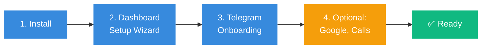
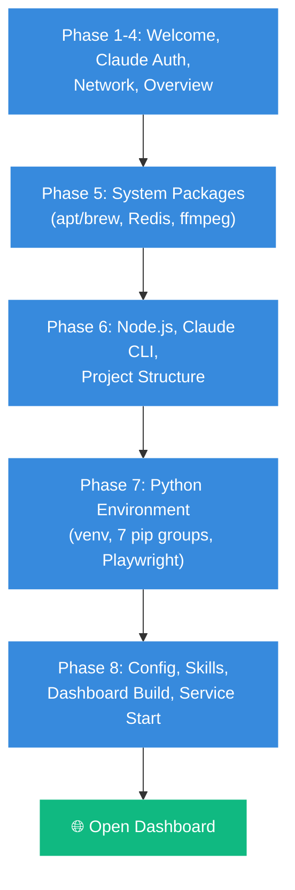
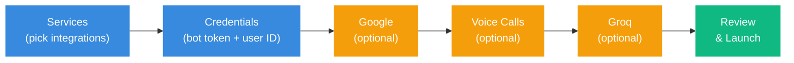

# KOVO Setup Guide

This guide walks you through installing and configuring KOVO from scratch.

## Overview



## Prerequisites

| Requirement | Details |
|---|---|
| **OS** | Ubuntu 24.04+ or macOS 13+ |
| **RAM** | 4GB minimum, 8GB+ recommended |
| **Disk** | 30GB+ free |
| **Claude** | Claude Max or Team subscription |
| **Browser** | For dashboard setup |

## Step 1: Install

Run the one-line installer:

```bash
curl -fsSL https://raw.githubusercontent.com/Ava-AgentOne/kovo/main/bootstrap.sh -o /tmp/kovo-install.sh
bash /tmp/kovo-install.sh
```

The installer is interactive — it walks you through 8 phases:



### During Installation

- **Claude Code auth**: The installer asks you to run `claude login` in another terminal. This opens a browser URL — log in with your Anthropic account.
- **Ports**: Default is 8080 (gateway) and 3000 (dev). Both are configurable.
- **Optional packages**: PyTorch, Whisper, py-tgcalls may fail on some platforms — that's fine, they're optional.

## Step 2: Dashboard Setup Wizard

After installation, open your browser:

```
http://<YOUR-IP>:8080/dashboard/setup
```

The wizard has 6 steps:



### Required: Telegram Bot

1. Open Telegram → search for [@BotFather](https://t.me/BotFather)
2. Send `/newbot` → follow prompts → copy the **bot token**
3. Message [@userinfobot](https://t.me/userinfobot) → copy your **numeric user ID**
4. Paste both into the wizard
5. Click **"Verify Token"** to confirm

### Optional: Google, Voice Calls, Groq

See the dedicated guides:
- [Google Auth Guide](GOOGLE-AUTH.md)
- [Voice Calls Guide](VOICE-CALLS.md)
- Groq: Just paste your API key from [console.groq.com](https://console.groq.com/keys)

## Step 3: Telegram Onboarding

After the wizard saves, open your bot in Telegram and send any message. KOVO starts a 5-question onboarding:

1. **Agent name** — What should I call myself?
2. **City** — Auto-detects timezone (40+ cities supported)
3. **Languages** — What languages do you speak?
4. **Occupation** — What do you do?
5. **Email** — Your email address

This creates `SOUL.md`, `USER.md`, and `MEMORY.md` — your agent's personality, knowledge about you, and memory.

## Step 4: Post-Setup (Optional)

| Task | How |
|---|---|
| Google authorization | Send `/auth_google` in Telegram ([details](GOOGLE-AUTH.md)) |
| Voice call auth | Send `/reauth_caller +NUMBER` in Telegram ([details](VOICE-CALLS.md)) |
| Security tools | Dashboard → Security → Install Tools |
| GitHub integration | Add `GITHUB_TOKEN` to Settings → Environment |

## Upgrading

From the dashboard: **Settings → Updates → Check → Apply**

Or from the command line:

```bash
bash scripts/update.sh --check
bash scripts/update.sh --apply
```

## Troubleshooting

| Problem | Fix |
|---|---|
| Dashboard shows "Not Found" | Navigate to `/dashboard` not `/` |
| Bot not responding | Check `TELEGRAM_BOT_TOKEN` in Settings → Environment |
| Claude Code errors | Run `claude auth status` on the VM |
| Voice calls go to voice message | Check logs: `tail -20 logs/gateway.log \| grep call` |
| Google says "not authorized" | Run `/auth_google` in Telegram |

## File Locations

| Path | Contents |
|---|---|
| `/opt/kovo` (Linux) or `~/.kovo` (macOS) | Everything |
| `config/.env` | Secrets (tokens, API keys) |
| `config/settings.yaml` | All configuration |
| `workspace/SOUL.md` | Agent personality |
| `workspace/MEMORY.md` | Long-term memory |
| `data/kovo.db` | SQLite database |
| `logs/gateway.log` | Service logs |
