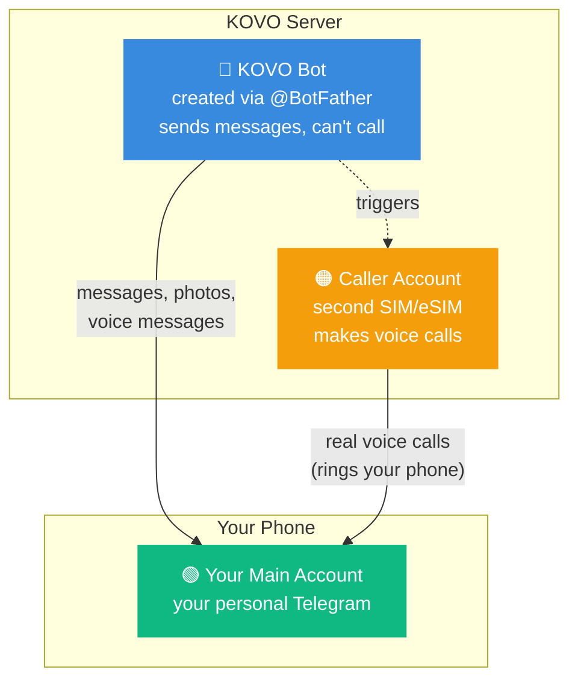
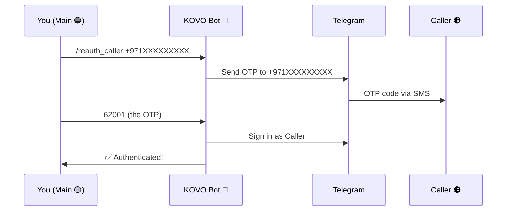

# Voice Calls Setup

KOVO can make real Telegram voice calls to alert you urgently. This requires a **second Telegram account** because Telegram bots cannot make voice calls — only real user accounts can.

## The Three Accounts



| Account | What it is | What it does |
|---|---|---|
| 🟢 **Main** | Your personal Telegram | Receives messages and calls from KOVO |
| 🔵 **Bot** | Created with @BotFather | Sends messages, handles commands. **Cannot call.** |
| 🟠 **Caller** | Second Telegram account | Makes real voice calls. Controlled by Pyrogram. |

## Setup Steps

### 1. Get a Second Phone Number

Options:
- Prepaid SIM card (cheapest)
- eSIM (no extra physical card)
- Google Voice number
- Any number that can receive one SMS for verification

### 2. Create the Caller Account

1. Install Telegram on any phone
2. Register with the second number
3. This becomes the **Caller account** 🟠

### 3. Get API Credentials

1. Open [my.telegram.org](https://my.telegram.org) in a browser
2. Log in with the **second number** (Caller 🟠, not your main)
3. Click **"API development tools"**
4. Fill in any app name (e.g. "kovo-caller")
5. Copy the **API ID** (number) and **API Hash** (hex string)

### 4. Enter in Setup Wizard

Paste the API ID and API Hash into the Voice Calls page of the Setup Wizard.

### 5. Authenticate the Caller

After the Setup Wizard is complete:

1. Open your **KOVO Bot** 🔵 in Telegram on your **main account** 🟢
2. Send: `/reauth_caller +971XXXXXXXXX` (the Caller's phone number 🟠)
3. Telegram sends an OTP to the Caller number
4. Reply with the OTP code in the bot chat



## How Calls Work

Once set up, KOVO triggers calls through natural language:

```mermaid
flowchart LR
    A["You: 'Call me\nwith the weather'"] --> B["KOVO fetches\nweather data"]
    B --> C["TTS generates\naudio message"]
    C --> D{"Call\nanswered?"}
    D -->|Yes| E["🔊 Plays audio\non call"]
    D -->|No (30s)| F["🎤 Sends voice\nmessage instead"]

    style A fill:#378ADD,color:#fff,stroke:none
    style E fill:#10b981,color:#fff,stroke:none
    style F fill:#f59e0b,color:#fff,stroke:none
```

You can also:
- `/call Hello from KOVO` — direct call command
- Say "ring me" or "phone me" — natural language
- Set reminders with call delivery: the agent outputs `[SET_REMINDER: message | time | call]`

## Keeping It Alive

- **Session health** is checked every 6 hours by the heartbeat system
- If the session dies, KOVO alerts you via Telegram message with fix instructions
- **Prepaid SIM**: top up every ~3 months to keep the number active
- The Pyrogram session file is stored at `data/kovo_caller.session`

## Common Issues

| Problem | Cause | Fix |
|---|---|---|
| Call goes to voice message | py-tgcalls error | Check `logs/gateway.log` for the error |
| "Caller not configured" | Missing API ID/Hash | Add them in Settings → Environment |
| OTP not arriving | Wrong phone number | Double-check the Caller's number |
| Session expired | SIM deactivated or Telegram revoked | Run `/reauth_caller` again |
| Import error on startup | py-tgcalls compatibility | Service auto-patches on restart |
